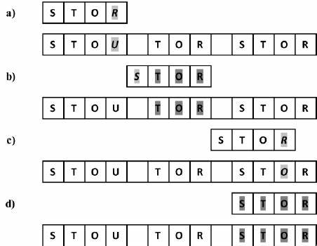

# pencocokan string
- T (Text) => string yang relativ panjang
    - dengan panjang karakter n
    - ex: "SAYA ALIEN"
- P (Patern) => string yang akan di cocokan dengan T
    - dengan panjang karakter m (asumsi m <<< n) yang akan dicari di dalam text
    - ex: "ALI"

## string concept
- string => rangkain / larik dengan tiap elemen adalah karakter
    - misal sebuah string S dengan panjang karakter m
    - S = x⁰x¹x²...Xm-1
        andrew = 012345

## prefix (awalan)
- awalan dari sebuah string yang merupakan bagian dari sub string yang harus diawali di index 0 dan berakhir di index k
    - k = suatu index antara 0 hingga m-1
    - Substring => S [0..k]
    - ex: T = andrew
        - k = 0, a
        - l = 1, an
        - a. an. and. adr, adre, andrew

## suffix (akhiran)
- akhiran dari sebuah string ....
    - k = suatu index antara 0 hingga m-1
    - Substring => [k..m-1]
    - ex: T = andrew
        - k = 0, w
        - k = 1, e

# algoritma
## algoritma brute force
- memeriksa satu persatu setiap karakter pada T apakah match dengan karakter pada P
- jika berbeda P akan mulai bergeeser 1 karakter di T
- ex
    - T : SAYA ALIEN
    - P : ALI
    - ........
        - 1
            - T : S
            - P : A (tdk cocok Text akan bergeser 1 ke kanan)
        - 2
            - T : SA
            - P :  A (cocok dan pattern akan bergeser)
        - 3
            - T : SAY
            - P :  AL (tdk cocok Pattern akan kembali ke index 0, dan Text akan bergeser ke kiri)
        - ...
            - T : SAYA
            - P :   A (dan seterusnya)

- kasus terburuk
        - ketika karakter awal pada pattern namun karakter terakhir berbeda pada text
            - sehingga kita mengulangi pemeerriksaan yang sama
        - ex: T: aaaaaaah p: aah
    
- kasus terbaik
        - ketika dari awal textt pattern meendapatkan karakter yang berbeda di karakter pertamnya
            - jadi tidak perlu mengulangin lagi
        - ex: T: sukabanget P: get

- analisis
        - pendekatan brute force cukup cepat ketika jenis karakter dari text dan pattern sangat beragam
            - ex: A..Z, a..z, 1..9, dll
        - pendekatan brute force akan lambat ketika jenis karakter pada text dan pattern tidak beragam
            - ex: 0, 1 (dalam binary files, images file, dll)

## algoritma KMP (Knuth-Morris-Pratt)
- mirip dengan algoritma brute force yang melakukan peergeseran dari kiri ke kanan
- pergeseran yang dilakukan lebih cerdas daripada bruteforce
    - menggunakan konsep prefix, dan suffix
        - prefix (awalan) S [0..k]
        - suffix (akhritan) S [k..m-1]
        - k = suatu index antara 0 hingga m-1
    - mempertimbangkan sebnyak mungkin pergeseran
        - tidak mengulang pemeriksaan yang sama 

- ketika terjadi mismatch maka pergeseran yang dilakukan 
    - adalah sebnayak nilai prefix P [0..j-1] terbesar
    - yang juga merupakan suffix P[1..j-1]

- ex:
    T : abaabx
        111110
    p : abaaba
    - ketika terjadi mismatch pada index 6, maka pergeseran yang dilakukan adalah sebanyak j = 5
        - prefix: a, ab, aba, abaa, abaab
        - suffix: b, ab, aab, baab
    - prefix dan suffix yang sama adalah ab
        - nilai 2 artinya index P yang diperiksa mulai dari index ke -2
        - dan pergeseran akan dikurangi 2
    - ...
        - 1
            T : abaabx
                111110
            p : abaaba (j = 5)
        - 2
            T : abaabx
                   110
            p :    abaaba (j = 2)

# algoritma booyer moore

- looking glass
    - memerika kecocokan pattern P dengan text T dimulai dari index terakhir pada P
    - namun pemeriksaan terhadap T tetap dimulai dari awal
        - dalam hal ini indeks i akan dimulai pada nilai m-1 (jika panjang P adalah m)
    - ex: T: SAYA ALIEN
               000
          P: ALI
          0 akan dimulai dari Y dengan pattern I

- character jump
    - dilakukan ketika terjadi mismatch (P[j] != T[i] dengan T[i] = x)
    - terdapat 3 kasus yang mungkin terjadi, periksa satu persatu sesuai urutan sebagai berikut
        - bisa dibilang lompatan / pergeseran
        - kasus 1
                Xa
                i
              xcba
                j
            - jika terdapat x di P dengan index yang lebih kecil daripada j 
                - seolah olah geserr P ke kanan agar posisi x di T[i] sejajar dengan posisi kemunculan terakhir

        - kasus 2
                XaX
                i
               cwax
                j
                x setelah diposisi j
            - jika terdapat x di P, tapi pada posisi index yang lebih besar daripada j
                - seolah olah geser P satu karakter ke kanan, agar posisi indeks terakhir P sejajar dengan (posisi akhir T sebelumnya)
        - kasus 3
                  Xa
                  i
                dcBa
                  j
                tidak ada x di P
                jadi dia akan melongkap sebanyak 4 index karena posisi x tidak pernah muncul lagi
            - mismatch pada T[i] dan P[j] dan karakter T[i] adalah x
                - jika kasus 1 dan 2 tidak ditemukan saat terjadi mismatch (karakter x tidak ditemukan papda P)
                    - seolah olah geser P agar posisi indeks pertama P (P[0]) sejajar dengan indeks i + 1

    - fungsi last occurrence (LO)
        - posisi kemunculan Terakhir suatu karakter pada p
        - untuk kasus 1 dan kasus 2 perlu informasi mengenai di mana kemunculan terakhir suattu karakter pada P
            - lakukan preproses fungsi, dengan menentukan posisi kemunculan terakhir semua karakter pada TEKS T di dallam Patern p
            - jika suatu karakter pada T tidak muncul di P, maka nilai fungsi last occurrence untuk karakter tersebut adalah -1
    
    - kasus terburuk O(nm)
        - T: aaaaa....aa
        - P: baaaaa
        - mirip seperti bruteforce
    - cepet untuk teks dengan variassi karakter yang sangat beragam (A besar) karakter bahasa inggris
    - lambat untuk teks dengan variasi karakter tidak beragam (karakter binary)
    - lebih cepat dibandingkan brute force untuk karakter dalam bahasa inggris